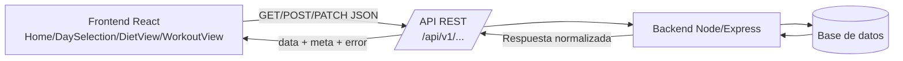

# Arquitectura y Diseno del Sistema: GOFIT

## 1) Estructura de componentes principales

La app actual es un SPA con React Router y un layout simple (`Header` + `main`) en `App`.

### Arbol de alto nivel

- `App`
  - `Header`
  - `Routes`
    - `Home` (`/`)
    - `DaySelection` (`/day/:dayId`)
    - `DietView` (`/day/:dayId/diet`)
    - `WorkoutView` (`/day/:dayId/exercise`)

### Responsabilidad por pagina

- `Home`: calendario semanal y punto de entrada al flujo diario.
- `DaySelection`: selector de modulo para un dia (`Dieta` o `Ejercicio`).
- `DietView`: visualizacion del plan de comidas del dia.
- `WorkoutView`: visualizacion y seguimiento de ejercicios del dia.

## 2) Componentes reutilizables (decision)

Para evitar duplicacion y facilitar crecimiento, se definen estos componentes compartidos:

- `PageHeader`: cabecera de pagina (titulo, subtitulo y acento visual).
- `PrimaryActionButton`: CTA principal con estados (`idle`, `loading`, `disabled`).
- `FeatureCard`: tarjeta clicable para modulos (ejercicio/dieta).
- `SectionList`: lista tipada para bloques repetidos (comidas, ejercicios, etc.).
- `BackButton`: boton de retorno con comportamiento consistente.
- `StatusBadge`: etiqueta para estado (`hoy`, `completado`, `pendiente`).

Regla: las paginas orquestan datos y navegacion; los componentes reutilizables se enfocan en presentacion y eventos.

## 3) Gestion de estado de la aplicacion

Se usara una estrategia por capas:

- **Estado local (`useState`)** para UI efimera:
  - filtros activos
  - modal abierto/cerrado
  - seleccion temporal de elementos
- **Estado global cliente (`Context`)** para datos transversales:
  - perfil activo
  - dia seleccionado
  - preferencias de interfaz
- **Estado servidor (React Query recomendado)** para cache y sincronizacion:
  - rutinas
  - planes de dieta
  - progreso del dia

### Estructura sugerida

- `AppContext`: sesion liviana y preferencias.
- `useWorkout(dayId)`: query para obtener rutina por dia.
- `useDiet(dayId)`: query para obtener dieta por dia.
- `useCompleteExercise()`: mutacion para marcar series/ejercicios.
- `useCompleteMeal()`: mutacion para marcar comidas.

## 4) Diseno backend/API REST

Prefijo base: `/api/v1`

Formato de respuesta estandar:

```json
{
  "success": true,
  "data": {},
  "meta": {},
  "error": null
}
```

Formato de error:

```json
{
  "success": false,
  "data": null,
  "meta": {},
  "error": {
    "code": "VALIDATION_ERROR",
    "message": "Campo goal no valido",
    "details": []
  }
}
```

### Recursos y contratos

#### 4.1 Perfil de usuario

- `GET /api/v1/profile`
  - Devuelve perfil activo.
- `PUT /api/v1/profile`
  - Actualiza edad, altura, peso, objetivo, experiencia.

`GET /profile` (200):

```json
{
  "success": true,
  "data": {
    "id": "usr_01",
    "name": "Sergio",
    "age": 28,
    "heightCm": 180,
    "weightKg": 75,
    "goal": "hypertrophy",
    "experienceLevel": "intermediate"
  },
  "meta": {},
  "error": null
}
```

#### 4.2 Rutinas

- `GET /api/v1/routines?day=lunes`
  - Obtiene la rutina de un dia.
- `POST /api/v1/routines/generate`
  - Genera/regenara rutina semanal en base al perfil.

`GET /routines?day=lunes` (200):

```json
{
  "success": true,
  "data": {
    "routineId": "r_12345",
    "day": "lunes",
    "exercises": [
      {
        "id": "ex_01",
        "name": "Press de Banca",
        "muscle": "Pecho",
        "sets": 4,
        "reps": "8-10",
        "restSec": 90,
        "completed": false
      }
    ]
  },
  "meta": {},
  "error": null
}
```

#### 4.3 Dieta

- `GET /api/v1/diets?day=lunes`
  - Obtiene dieta del dia.
- `POST /api/v1/diets/generate`
  - Genera dieta semanal.

`GET /diets?day=lunes` (200):

```json
{
  "success": true,
  "data": {
    "dietId": "d_100",
    "day": "lunes",
    "targetCalories": 2200,
    "macros": { "protein": 160, "carbs": 240, "fats": 66 },
    "meals": [
      {
        "id": "meal_01",
        "title": "DESAYUNO",
        "time": "08:00",
        "items": ["Tortilla de claras", "Avena con canela"],
        "completed": false
      }
    ]
  },
  "meta": {},
  "error": null
}
```

#### 4.4 Progreso diario

- `PATCH /api/v1/progress/exercises/:exerciseId`
  - Marca ejercicio como completado/no completado.
- `PATCH /api/v1/progress/meals/:mealId`
  - Marca comida como completada/no completada.
- `GET /api/v1/progress?day=lunes`
  - Devuelve estado agregado del dia.

Request ejemplo (`PATCH /progress/exercises/ex_01`):

```json
{
  "completed": true
}
```

Response (200):

```json
{
  "success": true,
  "data": {
    "exerciseId": "ex_01",
    "completed": true,
    "updatedAt": "2026-04-24T17:10:00.000Z"
  },
  "meta": {},
  "error": null
}
```

## 5) Persistencia: servidor vs cliente

### Persistir en servidor (fuente de verdad)

- perfil de usuario
- rutina generada (por dia/semana)
- dieta generada (por dia/semana)
- progreso de ejercicios/comidas
- historico resumido (racha, adherencia, fecha de ultima sesion)

### Solo cliente (estado efimero/UI)

- pagina activa y estados visuales temporales
- filtros y orden de listas
- estados de carga/transicion
- cache temporal de queries (gestionada por libreria de data fetching)

Nota: si se requiere modo offline, se puede guardar snapshot en `localStorage` con TTL corto, sincronizando al reconectar.

## 6) Diagrama simple de flujo de datos



## 7) Decisiones de arquitectura (resumen)

- Arquitectura cliente-servidor con API REST versionada (`/api/v1`) para facilitar evolucion.
- Componentes de UI reutilizables para mantener consistencia y bajar costo de cambios.
- Estado separado en tres niveles: local, global y servidor.
- Backend como duenio de la logica de negocio y persistencia.
- Contratos JSON estandar para facilitar manejo de errores y observabilidad.
